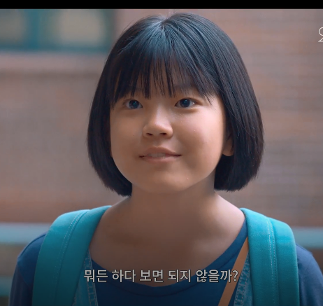

<h1>
우리집
</h1>

 
 

## 아이들에게 가장 필요한것

 

서울투어에서 롯데타워를 돌아다니다가 정말 우연히 우리집이 상영하는 걸 보았다. 이전에 예고편을 보고 보고 싶다는 생각이 들었었다 다른 독립영화 예고편처럼
우연인지 운명인지 시간도 바로 얼마 후였고 자리도 많았다. 마치 내가 이 영화를 보기를 바라는것처럼. 

영화는 문제가 있는 두 가정의 딸들의 이야기였다. 그들이 처한 문제는 분명 달랐지만, 일상적이고 현실적이며 가슴아픈 문제였다. 가슴아픈 문제, 평소라면 딱 거기까지만 보고 넘어갔을 법한 이야기를 이 영화는 아이들 시선에서 깊숙이 들어가서 보여준다. 
여자아이들의 이야기라 벌새처럼 공감이 안 갈수있었을 텐데 어린아이의 마음은 성별이랑 상관없이 공감이 느껴졌다.

이 아이들에게 필요한 게 무엇일까 영화에서 아이들은 경제적인 어려움이 하나도 없다. 
그들에게 결핍되어있는 건 그저 가족의 사랑과 그 사랑을 보관한 집뿐이다. 

주인공 하나의 가정은 집은 좋지만, 그 안에 가족의 사랑은 없다. 하나는 집 아니 가족을 지키기 위해 요리와 여행이라는 상투적인 방법을 쓴다.

그런데 그게 더 마음이 아프다 차라리 하나가 더 똑똑했다면 교활했다면 그래서 정말 가족을 하나로 묶을 수 있었다면 그랬다면 해피엔딩 코미디 영화가 되었겠지만
이 영화는 초등학생의 시선으로 초등학생이 할 말 한 행동들을 보여준다. 
같이 밥을 먹으면 가족이 같이 여행을 가면 다시 거짓말처럼 행복핼 질 수 있을 거라 생각하는것이다.

유진과 유미는 반대의 상황이다, 가족은 서로를 사랑하지만 부모님은 멀리 떨어져 있고 잦은 이사 때문에 친구도 없는 상태이다. 
그들은 집을 지키려고한다 가족이 있을 수 있는 물리적인 집을 말이다. 어쩌면 부모님이 멀리 있는 것도 정착할 집이 정해지지 않아서일지도 모른다.

이 아이들은 어린 생각과 행동으로 집이 팔리는 걸 막아보지만 결국 아이들의 어린 행동들은 파국을 맞는다. 
그로 인해 갈등이 발생하고 서로에게 상처를 준다,하나와 유미가 싸우는 장면이 더 가슴이 아픈 것은 이 아이들은 아무 잘못이 없기 때문 일 것이다. 
이 아이들은 그저 부모와 함께 살 집을 원했을 뿐인데, 그 당연해 보이는 것을 얻기 위해 온갖 고생을 다 하고 결국 서로 싸울 수밖에 없는 상황은 어른이 된 나에게는 너무 가슴 아픈 상황이었다.

아이들은 가족 없이 셋이서 사는 것을 꿈꿔보지만 이내 불가능하다는 사실을 알게 된다. 텐트에서 누워서 무엇을 먹으며 살지 고민하는 장면은 어른들에게 보여주는 지독하게 잔인한 장면이 아니었을까?

결국 아이들은 아무것도 바꾸지 못한 채 어른들이 정해놓은 현실로 돌아간다. 하지만 그 속에서도 그들은 서로를 생각하며 잊지 않을 것을 이야기한다.
그것이 이 잔인한 이야기 속에서 감독이 딱하나 심어놓은 희망의 씨앗일것이다.

